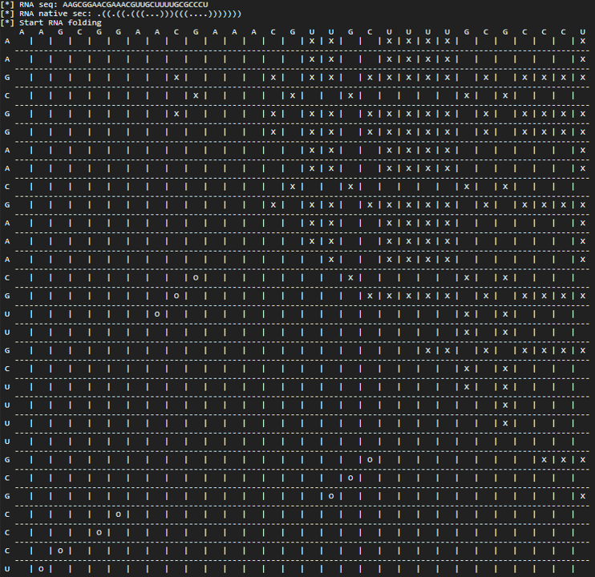

2dRNA-Fold: Learning RNA Folding Path based on Reinforcement Learning and Monte Carlo Tree Search
=======================

Contents
--------
  * [Introduction](#introduction)
  * [Results](#results)
  * [System Requirments](#system-requirments)
  * [Usage](#Usage)
  * [Datasets](#datasets)

Introduction
------------
We propose an RNA secondary structure folding path learning algorithm based on deep reinforcement learning combined with Monte Carlo Tree Search (MCTS), called 2dRNA-Fold. 2dRNA-Fold selects residue pairing step by step according to a given RNA sequence until the final secondary structure is formed. Then, we can find a folding path with the largest probability that is considered as the folding path of the RNA. The following diagram illustrates the entire pipeline.

|
|----|
| <p align="center"> <b>Figure 1:</b> The diagram of 2dRNA-Fold predicts the secondary structure folding path of a single RNA molecule.|

Results
-------
Here one small RNA with a length of 30 nucleotides is selected and used 2dRNA-Fold to learn and visualize their folding paths (shown as the figure 2). Its sequence secondary structure is:
```
AAGCGGAACGAAACGUUGCUUUUGCGCCCU
.((.((.(((...)))(((....)))))))
```

|
|----|
| <p align="center"> <b>Figure 2:</b> Learned folding path of an RNA. The top is the folding path tree, and the bottom is the visualized folding path.|


System Requirments
------------------
**Software Requirments:**
* [Python3](https://docs.python-guide.org/starting/install3/linux/)
* [Anaconda](https://anaconda.org/anaconda/)
* [TensorFlow](https://www.tensorflow.org/)


Usage
-----
**For secondary structure folding path of single sequence:**
```
python main.py --model model/PDB_00010 --fold data/PDB_00010.bp
```
For a single RNA molecule, here we provide some examples including trained models and data, see the `model` and `data` folders. This command is used to predict the secondary structure of a single RNA molecule and visualize the predicted folding path. The intermediate output process is shown in Figure 3.

|
|----|
| <p align="center"> <b>Figure 3:</b> secondary structure folding path prediction for single sequence.|

**For secondary structure prediction of single sequence:**
```
python main.py --model model/bpRNA_21650 --pred GGAGGCUCUGGCAGCUUUC
```


Datasets
--------
The following datasets were used for multi-RNA molecules folding path learning:
* bpRNA: [training set](./data/bpRNA_1m_90_standac_pkfree_canonbp_L50_770train.pkl) and [testing set](./data/bpRNA_1m_90_standac_pkfree_canonbp_L50_15test.pkl)


